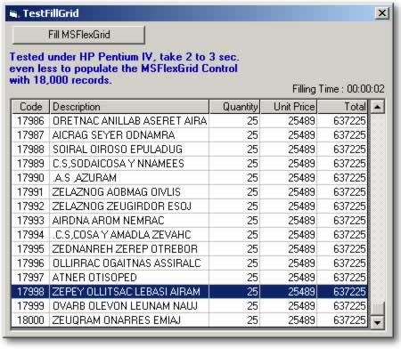



## Fast Fill MSFlexGrid

### Description

A very fast way to fill or populate a MSFlexGrid control with a Recordset 18,000 Records / 2 Sec.
 
### More Info
 
A very fast way to fill or populate a MSFlexGrid control with a Recordset (18,000 Records / 2 Sec.)

             |
---                |---
**Submitted On**   |2003-02-06 12:53:50
**By**             |[Carlos Vara](https://github.com/Planet-Source-Code/PSCIndex/blob/master/ByAuthor/carlos-vara.md)
**Level**          |Intermediate
**User Rating**    |4.7 (14 globes from 3 users)
**Compatibility**  |VB 5\.0, VB 6\.0
**Category**       |[Databases/ Data Access/ DAO/ ADO](https://github.com/Planet-Source-Code/PSCIndex/blob/master/ByCategory/databases-data-access-dao-ado__1-6.md)
**World**          |[Visual Basic](https://github.com/Planet-Source-Code/PSCIndex/blob/master/ByWorld/visual-basic.md)
**Archive File**   |[Fast\_Fill\_154033262003\.zip](https://github.com/Planet-Source-Code/carlos-vara-fast-fill-msflexgrid__1-43001/archive/master.zip)

